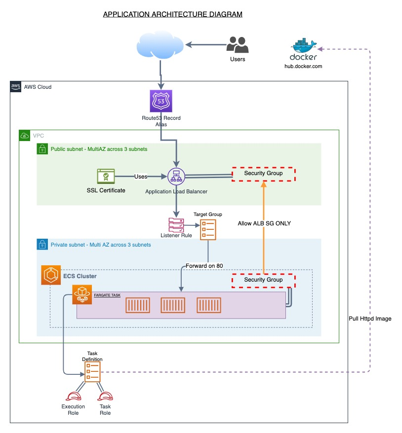

# Infrastructure as a Code using AWS Cloudformation
The purpose of this project is to Launch production serverless applications using fargate service and a https link for users to access the service.

# Infrastructure diagram

# HOW TO USE FILES IN REPO

create.sh
---------------

Run `bash create.sh httpd_servers  httpd_servers.yaml httpd_servers.json`

delete.sh
----------------
Run `bash delete.sh httpd_servers`

httpd_servers.json
-----------------------
Contains the json parameter file for your network environments. Can be used to change the environment name

httpd_servers.yaml
-----------------------
Contains the yaml file to launch the resources to access the service

update.sh
-------------------
Run `bash update.sh httpd_servers  httpd_servers.yaml httpd_servers.json`

Makefile
-------------------
Contains makefile to lint and deploy resources
In your terminal run

`Make Lint` to lint cfn files in project
`Make deploy` to deploy cfn files in project

# STEP BY STEP GUIDE TO LAUNCH WEBSITE ON AWS
* Navigate to mmt_iaac directory

* Run `Make Lint` to lint cfn files

* Run `Make deploy` to deploy resources

* Wait for httpd_servers stack to be created

* Click on the dns output URL in the httpd_servers stack to view website.
  This step may take a few minutes to configure

* Run `bash delete.sh httpd_servers`

* Wait for httpd_servers stack to be deleted

* Verify stack is deleted in console to avoid recurring charges
